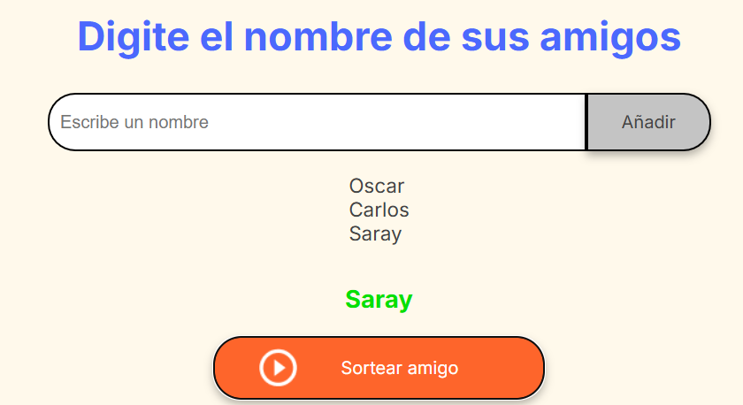

<h1>Challenge Amigo Secreto</h1>

<h2>Descripción</h2> 

Este proyecto es una página web interactiva que permite agregar nombres a una lista y mostrarlos en pantalla y ademas sortear un nombre al azar al presionar un botón.

<h2> Características principales</h2>

- Agregar nombres a la lista.
- Mostrar los nombres en pantalla.
- Sortear un nombre aleatorio.
- Interfaz simple y fácil de usar.

<h2> Tecnologías utilizadas</h2>

- <strong>HTML :</strong> Estructura de la página.
- <strong>CSS :</strong> Estilos y diseño.
- <strong>JavaScript :</strong> Lógica de interacción y sorteo.

<h2> Instalación </h2>

1. Clonar el repositorio:
   ```sh
   git clone https://github.com/oscar1098/challenge-amigo-secreto.git
   ```
2. Navegar al directorio del proyecto.
   
3. Abrir el archivo `index.html` en un navegador web.

<h2> Uso</h2>

1. Ingresar nombres en el campo de texto y presionar el botón de añadir.  

   

2. Los nombres ingresados se mostrarán en pantalla.  

   

3. Presionar el botón de sortear amigo para elegir un nombre al azar.  

   

